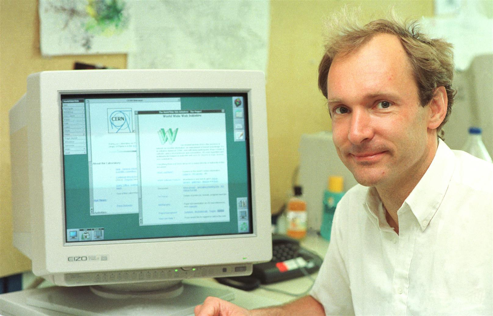

# Introdução

A história do front-end se confunde com a história da web, então para contar como o desenvolvimento front-end começou é preciso primeiro contar como Tim Berners-Lee inventou o HTML num laboratório do CERN em 1989.

Quando alguém pergunta a um desenvolvedor o que é front-end, a resposta é sempre algo como "o front-end é a _cara_ de um site ou de uma aplicação, aquilo que o usuário vê e/ou com o que ele interage". Logo, se a interação do usuário com uma página se dá através de um mouse, um teclado e uma tela, então tudo começou a partir de um clique em especial.

# O Clique de Tim Berners-Lee

A World Wide Web — ou "Web", para os mais íntimos — nasceu com um cientista da computação que trabalhava no CERN. Na época com 33 anos, Tim tinha como objetivo original conectar artigos sobre Física para que cientistas os acessassem por meio das referências nas notas de rodapé. Essa invenção é conhecida hoje sob o nome de _hyperlink_, os links azuis que após serem clicados ficam roxos. Nasce então o **HTTP** (_HyperText Transfer Protocol_), protocolo de comunicação entre servidores e clientes cujo objetivo original era conectar universidades.

# Anos 90

## Os primeiros browsers

A invenção de Lee ganhou rápida aceitação e logo chamou atenção de outros estudiosos, então em 1993 é apresentado o primeiro navegador web que se tornaria amplamente popular, o **Mosaic**. Entre seus criadores estava Marc Andreessen, que mais tarde foi também cofundador da Netscape e cocriador do seu famoso browser, o **Netscape Navigator**. De 1989 até 1994, embora promissora, a World Wide Web ainda era uma tecnologia de nicho usada majoritariamente por universidades, por governos e por empresas privadas. Com a popularização do Mosaic e após o surgimento de empresas como a ex-gigante AOL (America Online), a Microsoft lança um navegador curiosamente similar ao Netscape e dá o pontapé no interessante período chamado de “A Guerra dos Navegadores”.

## A Guerra dos Navegadores (1995–1999)

A Microsoft não assistiu calada à ascensão, lado a lado, da popularidade do Netscape Navigator e da web. Após licenciar o código do antigo Mosaic, ela lança seu sucessor espiritual, o **Internet Explorer**. Esse movimento deu início à era conhecida como a Guerra dos Navegadores, na qual as duas empresas de software entraram numa corrida pela implementação de novas funcionalidades para seus navegadores a fim de conquistar a liderança entre os usuários. Dentro da Netscape surge o **JavaScript**, linguagem de programação capaz de adicionar funcionalidades extras ao HTML. Por outro lado, o IE3 passa a suportar CSS, o que obriga a Netscape a implementá-lo a contragosto na próxima versão do seu produto, o Navigator 4. O resultado foi que muitos dos avanços que o CSS oferecia simplesmente não funcionavam no Netscape, ao contrário do IE.

Essa disputa que se seguiu acabou ganhando outro concorrente, o norueguês Opera. Ele já suportava o CSS1 e, graças às _media queries_, ficou conhecido como um browser amigável a telas pequenas, abocanhando o espaço de mercado povoado pelos primeiros telefones celulares com suporte a internet.

Em 1999, enquanto enfrentava ações judiciais antitruste por ter forçado a instalação e utilização do IE no Windows em detrimento dos concorrentes, entre outras acusações, o Internet explorer alcançava inimagináveis 99% de _market share_. Dentre as outras acusações estão a de ter distribuído para Windows uma versão do Java que era incompatível com a da sua detentora, a Sun Microsystems. Outra prática considerada anticompetitiva foi a de mesclar Internet Explorer e Windows Explorer (o explorador de arquivos padrão), fazendo com que a única forma de acessar arquivos na internet e arquivos locais fosse por meio deles.

A resposta da Netscape foi brutal: abriu o código do Navigator, permitindo que qualquer um fizesse melhorias ou criasse _forks_ a partir dele. Surge assim o Projeto Mozilla, cerne do que em 2004 culminaria na criação do **Mozilla Firefox**, sucessor espiritual do Netscape. Até 2003, a Apple ainda utilizava o IE como seu navegador padrão, quando a Microsoft o descontinuou para o Mac OS X. No mesmo ano é anunciado o **Safari**, browser cujo código foi baseado no Konqueror, navegador pertencente ao projeto KDE, um dos ambientes gráficos mais famosos entre as distros Linux.

# Anos 2000

## As primeiras ferramentas para internet e o boom

Nessa mesma época, entre 1995 e 2003, nascem o **PHP**, os já mencionados **Java** e **JavaScript** e a biblioteca **Flash**. Nasce também o **Apache HTTP Server**, o **Windows Server**, o **Microsoft FrontPage**, o **Macromedia DreamWeaver**, entre outras linguagens de programação e ferramentas que pavimentariam o caminho para o _boom_ da internet a partir de então. O avanço dessas tecnologias e linguagens permitiu o surgimento dos primeiros CMSs (_Content Management Systems_), como o **Joomla**, o **Vignette**, o **Drupal** e, finalmente, o **Wordpress**, em 2003.

No CSS, a evolução do CSS1 para o CSS2 facilitou a transição para páginas _tableless_, ou seja, abandonando as tags `<table />` para layouts em favor da semântica do CSS. Sim, acredite se quiser, há 20 anos os sites eram feitos usando tabelas HTML e isso era [uma pedra no sapato da W3C](https://www.w3.org/2002/03/csslayout-howto), a entidade liderada por Tim Berners-Lee que define e regulamenta os padrões para a web.

Em 2004, o Google adota o **AJAX** (_Asynchronous JavaScript and XML_), tecnologia que permite ao JS interagir com o servidor de forma dinâmica, em background. O resultado foi o **Gmail**, serviço que mudaria para sempre a forma como e-mails são utilizados, até então majoritariamente através de programas nativos para desktop. Foi uma verdadeira revolução e um vislumbre do poder dos _web apps_. A Microsoft viu diante de seus olhos surgir uma pedra no sapato grande maior do que o esperado: o Gmail era a prova final de que as limitações impostas pelo seu ecossistema pouco importavam mais. Tornava-se dispensável a utilização exclusiva do Outlook para gerenciar e-mails; bastava abrir qualquer navegador e voilà: seu serviço de e-mail estava lá, perfeitamente agnóstico ao OS a partir do qual o usuário estivesse acessando a internet.

Na mesma época nascem também os primeiros *frameworks* — em especial o _Ruby On Rails_ como conjunto de ferramentas para facilitar a construção de sites e blogs — e bibliotecas como o **jQuery** (escrito em JavaScript) e o Scriptaculous (escrito em Ruby), utilizados para facilitar a padronização do HTML, do CSS e do JS entre a maioria possível de navegadores e páginas, aprimorando substancialmente a experiência do usuário.

## O início da padronização da Web

Em agosto de 2008 aconteceu um fato curioso: o **DHH**, criador do Ruby On Rails e CEO do Basecamp, anunciou em seu blog que o Basecamp não mais suportaria o **Internet Explorer 6**. Uma decisão drástica porém necessária para começar a pregar o caixão do navegador mais odiado da história. Lançado justamente com o — para muitos nostálgico — Windows XP, o IE6, embora bastante popular, possuía problemas demais e respeito de menos pelos padrões da web da época e pelos seus concorrentes principais, Mozilla Firefox e Google Chrome. Segundo DHH, o browser tornava o desenvolvimento de software pior apenas para beneficiar de forma mesquinha os interesses de centralização da web nas mãos da Microsoft.

Em dezembro de 2008, Douglas Crockford lança um livro que influencia desenvolvedores a tentar tornar o JS uma linguagem melhor. Coincidentemente ou não, no ano seguinte o JavaScript recebeu uma atualização que dividiu águas. O ECMAScript 5 (ou ES5 pros mais íntimos) foi considerado o renascimento do JS, trazendo getters/setters, novos métodos de `Object`, de `Array` e de `Date`, a função `bind`, o JSON, objetos globais imutáteis ( `undefined`, `NaN` e `Infinity`), o Scrict Mode, entre outras novidades.

# Anos 2010

## Os primeiros iPads e o Flash

Em 2010 é anunciado o iPad, três anos após o primeiro iPhone. Uma peculiaridade sobre esse produto popular desde seu cerne é que o Flash rodando em iPads era um assassino de performance de baterias. No mesmo ano, em uma carta chamada “_Thoughts on Flash_”, publicada pelo Wall Street Journal, Steve Jobs afirma que os bugs e falhas de segurança do Flash eram ruins para o iPad, e a Apple iria passar a bloqueá-lo por padrão. Assim como o post do DHH foi um marco em direção à morte do Internet Explorer 6, a carta de Jobs foi o começo da Apple matando o Flash.

## HTML5, CSS3 e o jQuery

Ainda em 2010, uma versão do editor de código Visual Studio dá suporte ao jQuery, um sinal do mercado acenando mais uma vez com bons olhos para o JavaScript. Com a disseminação dessa biblioteca e a derrocada do Flash, muitos desenvolvedores passaram a encarar o JS com menos desconfiança.

Ainda sobre a Apple, a chegada dos iPhones 3 anos antes estabelece o poder de influência da empresa sobre o design da próxima década; e soluções como **Sass**, **Less** e **Bootstrap** tornam-se cada vez mais populares. A reusabilidade de elementos, a simplicidade e a praticidade fazem com que cada vez mais desenvolvedores joguem suas pás de cal no design da web espalhafatosa surgida nos primórdios do CSS, dando lugar ao minimalismo. No entanto, o número cada vez maior de _assets_ para navegadores terem que lidar ao renderizar páginas mais pesadas do que nunca, somado às limitações de hardware e de velocidade de conexão da época, tornou necessárias novas soluções. A minificação foi uma delas e consiste na geração de _bundles_ de assets. A técnica consiste em remover indentação, espaços e nomes semânticos para variáveis, entre outras alterações, tudo isso para gerar textos comprimidos porém perfeitamente legíveis a nível de interpretador/motor.

## Angular, React e VueJS

Pensando em deixar o AJAX para trás a fim de gerenciar os estados das aplicações web de forma mais independente do servidor e definindo a linha que divide o desenvolvimento front-end do back-end, em 2010 o Google apresenta para o público o framework **AngularJS** — até então um projeto interno. O AngularJS define como o desenvolvimento de páginas web será feito a partir de agora, estabelecendo de vez as **Single-Page Applications** (SPA, para os mais íntimos) como um dos pilares da web moderna. As SPAs consistem em componentes e subcomponentes interagindo entre si, repaginando (_no pun intended!_) o conceito de recarregamento de telas como conhecíamos até então. O refresh é abandonado, pois cada componente da tela agora sabe quando re-renderizar a si próprio dinamicamente a partir de alterações de estado cuja independência/interdependência é definida pela própria aplicação.

Em 2013 é a vez do **Facebook** anunciar para o mundo open-source a sua própria biblioteca para SPAs, o **ReactJS**. Seguido pelo **Angular** (atualmente sem o “JS” no nome) e do **VueJS**, o React é hoje a biblioteca mais popular para criação de interfaces.

# Palavras finais

Este texto apresentou uma visão geral — e, portanto, resumida — da história do front-end. A escolha de interligá-la à história da própria web é uma escolha do autor, que optou por não omitir (ou mencionar apenas brevemente) tecnologias e linguagens que tiveram mais importância do que a pouca ênfase aqui deu a entender. Como desses 30 e poucos anos eu testemunhei menos da metade, muitas informações aqui são fruto de pesquisas às fontes originais. Elas estão todas na bibliografia e valem muito a pena a leitura.

Um outro ponto de debate seria tentar descobrir se a separação entre front-end e back-end realmente se iniciou com a criação do HTML e se intensificou dos anos 2010 para cá, ou se a convivência entre a computação e o _output_ dessa computação em máquinas como a de **Anticítera**, a **Máquina Analítica de Babbage & Lovelace** e a **Bombe de Turing**, por exemplo, seriam evidências de um front-end ancestral, precursor ao das telas dos PCs modernos.

Essa discussão instigante se estende também a tipos mais experimentais de interfaces como as de realidade aumentada e realidade virtual. Mas — inevitavelmente já colocando aqui uma posição sobre o assunto — isso é assunto para outro texto.

# Bibliografia

- [A brief history of tables](http://www.barrypearson.co.uk/articles/layout_tables/history.htm) (Barry Pearson)
- [Thoughts on Flash](https://web.archive.org/web/20170615060422/https://www.apple.com/hotnews/thoughts-on-flash/) (Steve Jobs)
- [How We Got Here — The History of Web Development](https://www.youtube.com/watch?v=41mnNyMxPOA]%28https://www.youtube.com/watch?v=41mnNyMxPOA) (Richard Campbell)
- [The History of Web Browsers](https://www.mozilla.org/en-US/firefox/browsers/browser-history/) (Mozilla)
- [A brief history of CSS until 2016](https://www.w3.org/Style/CSS20/history.html)
- [A história do front-end para iniciantes em programação](https://www.youtube.com/watch?v=VKmPGmFY7H4) (Fabio Akita)
- [Tableless layout HOWTO](https://www.w3.org/2002/03/csslayout-howto) (W3C)
- [Why Do So Many Geeks Hate Internet Explorer?](https://www.howtogeek.com/howto/32372/htg-explains-why-do-so-many-geeks-hate-internet-explorer/) (How-To Geek) —
- [History of front-end frameworks](https://blog.logrocket.com/history-of-frontend-frameworks/) (LogRocket)
- 10 Years On, Gmail Has Transformed the Web as We Know It — [10 Years On, Gmail Has Transformed the Web as We Know It | WIRED](https://www.wired.com/2014/04/gmail-ten/)
- [What’s a Web Development Framework & Why Are They Useful?](https://careerfoundry.com/en/blog/web-development/responsiveness-with-a-front-end-framework/) (Eric An)
