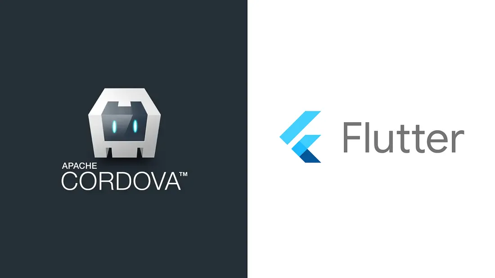

Recently I have faced the challenge of migrating data from the existing Cordova app in the playstore to the flutter app.

Have you heard about Apache Cordova? I am not. After googling, I know what it is.

Apache Cordova is an open-source mobile development framework. It allows you to use standard web technologies such as HTML5, CSS3, and JavaScript for cross-platform development, avoiding each mobile platforms’ native development language. Applications execute within wrappers targeted to each platform, and rely on standards-compliant API bindings to access each device’s sensors, data, and network status.

What are my choices for migrating?
- Local database &
- SharedPreference

Luckily there was a local database and sharedpreference in the app folder but both are failures.

I tried Sqlite Browser to check if any data stored in local database. There are two tables with zero records. There is sharedpreference file named WLPrefs.xml (Worklight Preferences). Some data is there but there is no use of them after checking with the Bank people.

Where the local data is stored, I have no idea and confess the bank officials. But they are not willing to make the 100k+ users to login again after update. Then I had a call with my team leader and managing director (techie) but they both are out of ideas of migrating. Then i was doomed.

Bank officials arrange a meeting with a Cordova developer as a last hope. He jumped in the code and somehow run it in the Browser(WTH). And showed the local data is stored as Local storage (which is browser thing) in a browser. I absolutely have no idea who can I access the local storage data in flutter. Sit back, relax and listen to my struggle.

I found there is a folder named app_webview in Cordova app folder. After exploring app_webview there was a file as 0000003.log, which is an UTF-8 encoded file. I opened the file in Notepad. It is messy but I found the information which I saw in the browser. But updated flutter app is not creating app_webview folder.

How to create a app_webview folder in flutter app directory?
- I created a webview page (webview_flutter: ^3.0.4). It is automatically created a app_webview.

First mission accomplished

I found that the flutter is creating file or folder if they are not existing.

How to get data from the app_webview folder?
- There are a package called localstorage: ^4.0.0+1. But there is no use of it. Because there localstorage save it in a seperate file.

So I created a file as below,
```html
<html>
<body>
<script>
// Check browser support
if (typeof(Storage) !== "undefined") {

   var data = {};
   for(i = 0; i < localStorage.length; i++) {
      if((localStorage.key(i) == "APP_TOKEN") || (localStorage.key(i) == "ACCOUNT_NUMBER"))
      {
          data[''+localStorage.key(i)+''] = localStorage.getItem(localStorage.key(i));
      }
   }
   MyHandler.postMessage(JSON.stringify(data));
}
</script>
</body>
</html>
````

I prefer this way to extract the information you want. Save it in asset folder. But you can’t load this file in Webview from asset folder, instead you have to give the URL directly from the app_folder. Set this file as Webview URL.

```dart
WebView(
  javascriptChannels: <JavascriptChannel>{
    return JavascriptChannel(
        name: 'MyHandler',
        onMessageReceived: (JavascriptMessage message) async {
          //Convert the string into json
          var data = json.decode(message.message);
    });
  },
  javascriptMode: JavascriptMode.unrestricted,
  onWebViewCreated: (controller) {
    _controller.complete(controller);
  },
  initialUrl:
      "file:///android_asset/flutter_assets/assets/readData.html",
)

```
You will get the localstorage information, in Javascript channel in MyHandler when the Webview is loaded.

> Do not call the Webview for the second time. After you get the JavascriptMessage save the data in the SharedPreference.

It took almost a day to figure out the solution for this problem. It is really a new experience to migrate data from existing app.

If you want to migrate information from Cordova to Flutter this is one of the way to do. I used this way to migrate data for Banking app.

Conclusion: If you ever stuck with something impossible, take a step back and break the tasks into small chunks. Complete one by one. You will get a motivation after completing each one of them. Life is really simple, we are the one, making it complex. Cheers.