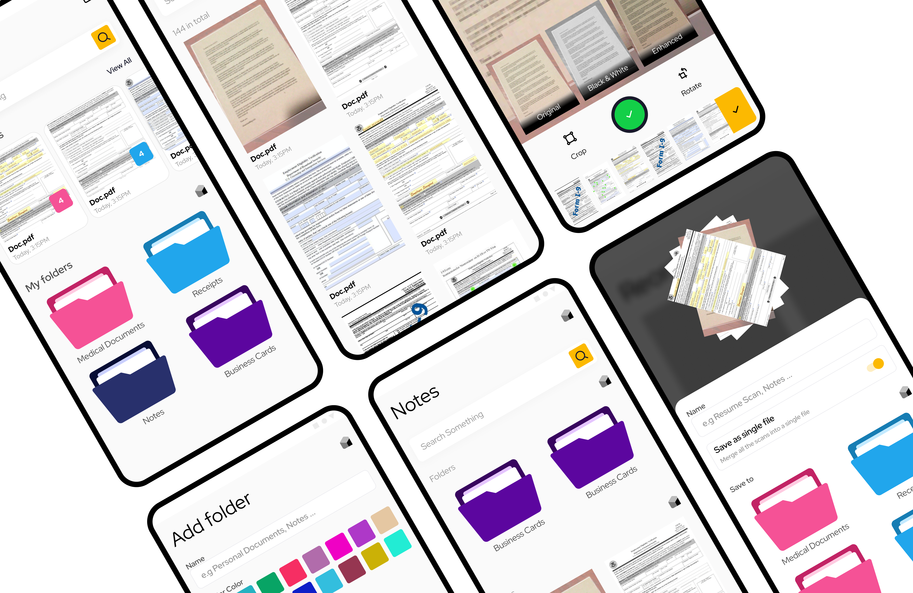

This project involves the development of a Local File Explorer App using Flutter. The app allows users to scan files from their local storage, save them in desired formats, and incorporates advanced animations to enhance the user experience. The app is designed to be intuitive, visually appealing, and functional, leveraging Flutter's powerful animation capabilities.

#### Key Features

- <b>File Scanning:</b>
      - Users can scan and browse files from their local storage.
      - Supports various file types (e.g., documents, images, videos, etc.).
- <b>File Saving:</b>
      - Users can save files in their desired format (e.g., PDF, JPEG, PNG, etc.).
      - Provides options to rename files and choose the save location.
- <b>Advanced Animations:</b>
      - Smooth transitions and animations for file browsing, selection, and saving.
      - Custom animations for file previews and folder navigation.
- <b>User-Friendly Interface:</b>
      - Intuitive UI with clear navigation and feedback.
      - Responsive design for both mobile and tablet devices.
- <b>Search and Filter:</b>
      - Users can search for specific files or filter them by type, size, or date.
- <b>File Preview:</b>
      - Preview files before saving or opening them.

#### Tech Stack

- <b>Frontend: </b>Flutter (Dart)
- <b>State Management: </b>Provider or Riverpod (for managing app state)
- <b>File Handling: </b>file_picker and path_provider packages
- <b>Animations: </b>Flutter's AnimationController, Hero, and custom animations
- <b>File Conversion: </b>External libraries like pdf for PDF creation or image_picker for image handling
- <b>Storage: </b>Local device storage (using path_provider for accessing directories)

#### Detailed Features
1. <b>File Scanning</b>
    - The app uses the file_picker package to allow users to browse and select files from their local storage.
    - Users can navigate through folders and view files in a grid or list layout.
    - File metadata (e.g., name, size, type) is displayed for each file.

2. <b>File Saving</b>
    - Users can select a file and choose a format to save it in (e.g., convert an image to PDF).
    - The app provides options to rename the file and select a save location.
    - File conversion is handled using appropriate libraries (e.g., pdf for PDF creation).

3. <b>Advanced Animations</b>
    - **Folder Navigation:** Smooth transitions when opening or closing folders.
    - **File Selection:** Highlight animations when a file is selected.
    - **File Preview:** Hero animations for transitioning between file thumbnails and full previews.
    - **Save Confirmation:** Animated feedback when a file is successfully saved.

4. <b>Search and Filter</b>
    - Users can search for files by name or filter them by type, size, or date.
    - The search and filter functionality is implemented using Flutter's ListView.builder and custom filtering logic.

5. <b>File Preview</b>
    - Users can preview files before saving or opening them.
    - Supported file types include images, documents, and videos.
    - The preview screen includes options to save, share, or delete the file.

#### Conclusion

This Local File Explorer App demonstrates my expertise in Flutter development, including file handling, state management, and advanced animations. The app provides a seamless and visually appealing experience for users to scan, preview, and save files in their desired formats. This project highlights my ability to create functional and aesthetically pleasing applications using Flutter.