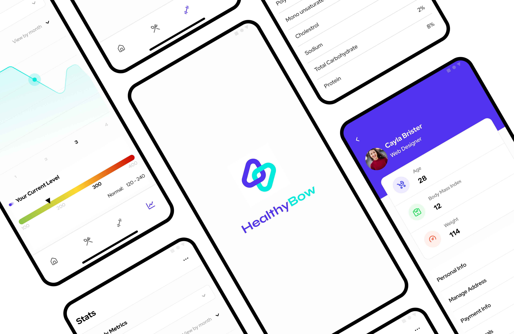

HealthyBow is a feature-rich Android application designed to help individuals monitor and maintain their health. The app provides personalized daily exercise routines, meal plans, health tracking, appointment booking, and a social timeline for users to share their wellness journey. With integrated body analysis, medical checkups, and expert-curated plans from nutritionists and physicians, HealthyBow serves as a one-stop solution for users aiming to stay healthy and fit.

#### Tech Stack:

- <b>Backend & API:</b> CodeIgniter (PHP) – A lightweight MVC framework used for building RESTful APIs.
- <b>Frontend (Admin Panel UI):</b> Bootstrap – Responsive and user-friendly admin interface.
- <b>Mobile App:</b> Native Android (Java/Kotlin) – Ensures smooth performance and real-time updates for users.
- <b>Database:</b> MySQL – Stores user health data, meal plans, exercise routines, and medical reports.

#### Key Features & Functionality:

- <b>User Authentication & Profile Management</b> – Secure login and personalized health dashboard for each user.
- <b>Daily Exercise Plans</b> – Custom exercise routines designed by expert physicians, updated regularly.
- <b>Personalized Meal Plans</b> – Nutritionist-created meal plans tailored to users’ health conditions, with daily updates.
- <b>Health Tracking & Reports</b> – Users can log and monitor health values such as weight, BP, and sugar levels.
- <b>Appointment Booking</b> – Users can schedule monthly body checkups and optional blood tests.
- <b>Medical Reports & Body Analysis</b> – Detailed health checkups (over 15 per month) with reports stored securely on the server.
- <b>Meal Delivery Service</b> – Custom meal plans are delivered to users' registered addresses.
- <b>Social Timeline</b> – Users can post images and text updates related to their health journey.
- <b>Referral Program</b> – Customers can refer friends and family to get discounts on premium plans.
- <b>Manual Payment Processing</b> – Payment details and transaction history are displayed within the app.
- <b>Feedback & Support</b> – Users can submit feedback and suggestions directly from the application.
- <b>Real-time Updates & Notifications</b> – The app receives and displays the latest updates from the company regarding new features and services.

HealthyBow is designed to provide a holistic approach to personal healthcare, combining expert guidance, meal delivery, and health tracking in one seamless platform.