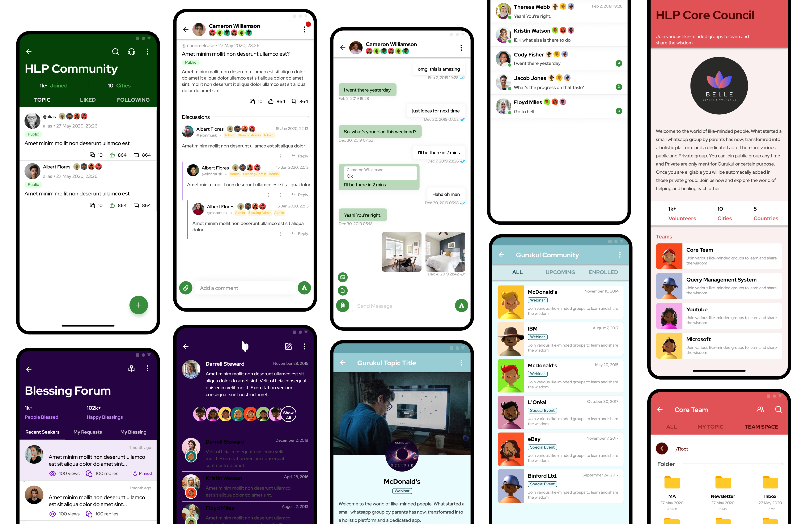

This project involves the development of a comprehensive community platform that includes multiple modules such as Home Page, Blessing Community, HLP Community, Gurukul Community, and Core Council. The platform is designed to facilitate various types of user interactions, including discussions, blessings, and course-related activities. The platform is built using a robust tech stack including Spring Boot, Angular, Flutter, and PostgreSQL.

#### Modules
1. <b>Home Page</b>
- The Home Page serves as the entry point for users. It provides navigation to different communities and features available on the platform.

2. <b>Blessing Community</b>
- The Blessing Community is an open community where users can request and send blessings to each other. Key features include:
    - <b>Blessing Requests:</b> Users can view and respond to blessing requests.
    - <b>Notifications:</b> Users receive notifications when someone sends them a blessing.
    - <b>Admin Controls:</b> Admins can hide, edit, and create default blessings.
    - <b>User Profiles:</b> Visual representation of the types of blessings a user has offered.

3. <b>HLP Community</b>
- The HLP Community is an open community with a focus on discussions and research. Key features include:
    - <b>Topic Management:</b> Admins can edit, hide, and manage topics.
    - <b>Research Team:</b> Admins can assign topics to the research team for further action.
    - <b>Flagging Users:</b> Admins can flag users, and these flags are visible only to the core team.
    - <b>Content Approval:</b> Links, photos, and files added by users require admin approval.

4. <b>Gurukul Community</b>

- The Gurukul Community is dedicated to discussions related to courses conducted on the platform. Key features include:
    - <b>Course Access:</b> Only paid members can access course-related topics.
    - <b>Student Interaction:</b> Students can discuss and share wisdom from the courses they have attended.

5. <b>Core Council</b>

- The Core Council is an internal community for admins and backend team members. Key features include:
    - <b>Group Management:</b> Super admins can create and manage groups.
    - <b>File Sharing:</b> Common folders for file sharing within teams.
    - <b>Notifications:</b> Core team members receive notifications from their respective groups.
    - <b>Badges:</b> Members earn badges for their contributions.

#### Technical Stack
  - <b>Backend:</b> Spring Boot
  - <b>Frontend:</b> Angular (Web), Flutter (Mobile)
  - <b>Database:</b> PostgreSQL

#### Detailed Features
1. <b>Blessing Community</b>
    - <b>User Interaction:</b>
        - Users can log in and view a list of blessing requests.
        - Users can respond to requests with predefined or custom blessings.
        - Notifications are sent to users when they receive a blessing.
    - <b>Admin Controls:</b>
        - Admins can hide or edit blessing requests.
        - Admins can create default blessings with predefined messages and images.
        - User profiles display a visual representation of the types of blessings offered.

2. <b>HLP Community</b>
    - <b>Topic Management:</b>
        - Admins can edit, hide, and manage topics.
        - Topics can be flagged for research and assigned to the research team.
    - <b>Research Team:</b>
        - Research team members have access to "My Research" and "All Pending Research" tabs.
        - Research topics can be forwarded to the content, design, and publishing teams.
    - <b>User Flagging:</b>
        - Admins can flag users, and these flags are visible only to the core team.
        - Core team members can add comments and view the history of flagged users.
    - <b>Content Approval:</b>
        - Links, photos, and files added by users require admin approval before being posted.

2. <b>Gurukul Community</b>
    - <b>Course Access:</b>
        - Only paid members can access course-related topics.
        - New members can join recorded sessions by paying.
    - <b>Student Interaction:</b>
        - Students can discuss and share wisdom from the courses they have attended.

3. <b>Core Council</b>
    - <b>Group Management:</b>
        - Super admins can create and manage groups.
        - Groups have common folders for file sharing.
    - <b>Notifications:</b>
        - Core team members receive notifications from their respective groups.
    - <b>Badges:</b>
        - Members earn badges for their contributions to the community.

#### Conclusion

This community platform is designed to facilitate various types of user interactions and provide robust administrative controls. The use of Spring Boot, Angular, Flutter, and PostgreSQL ensures a scalable and efficient system. This project showcases my ability to design and implement complex web and mobile applications with a focus on user experience and administrative functionality.