Horizon is an all-in-one HR management solution designed to simplify, automate, and optimize HR operations for businesses of all sizes. From employee management and payroll processing to leave tracking and recruitment, Horizon provides a comprehensive suite of tools to streamline HR workflows. Built with Next.js, Quarkus, and PostgreSQL, Horizon offers a modern, scalable, and user-friendly platform for managing all aspects of human resources.

### Key Features

#### 1. Sign Up & Sign In
- **Sign Up:** Organisations can sign up and login with the password received from their inbox.
- **Sign In:** Employees log in using the password sent to their registered email.

#### 2. Dashboard Overview

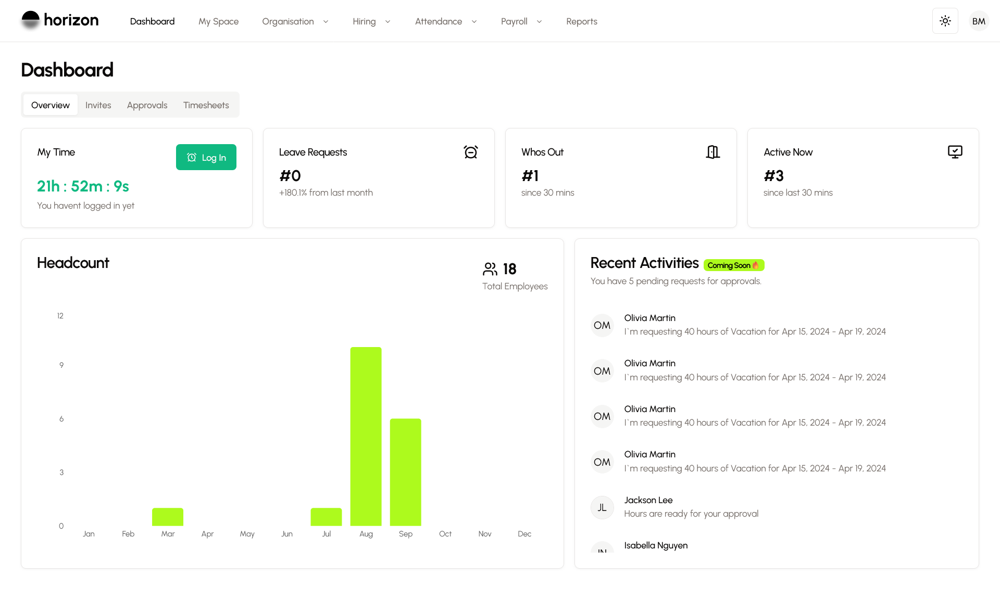

- Provides a real-time snapshot of HR operations, including:
    - Employee count
    - Leave requests
    - Active users
    - Employees on break
- Employees can punch in for the day with one click, ensuring seamless attendance tracking.

#### 3. Employee Self-Service

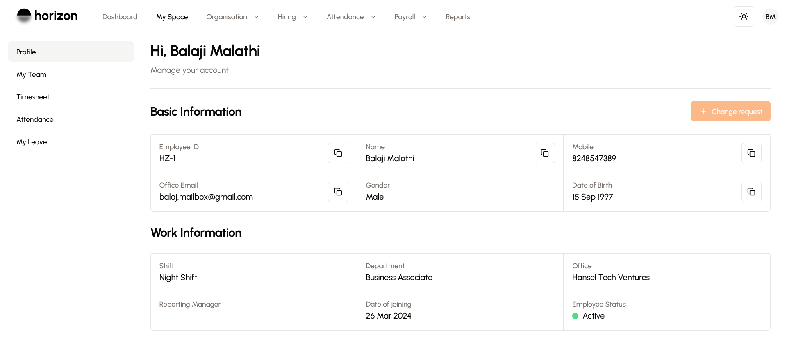

- **My Space:** Employees can view personal details, connect with team members, check timesheets and attendance, and request leave.
- **Role-Based Access:** Employees have access only to the Dashboard and My Space, ensuring data security.

#### 4. Organization Management
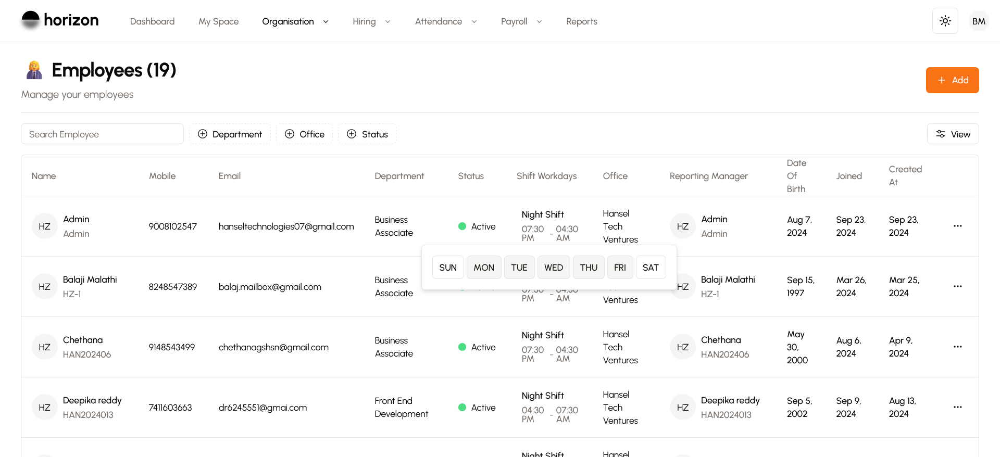
- **Employee Management:** Add employees, assign roles, and define department access. Collect bank details for payroll and configure salary components.
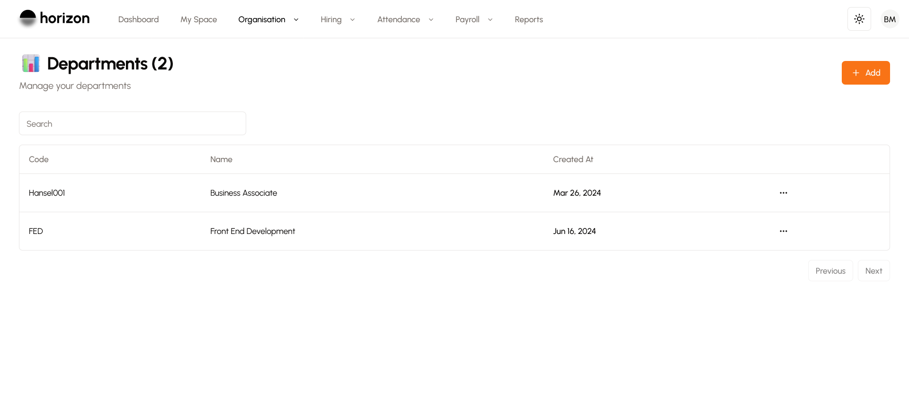
- **Department Management:** Create departments and assign employees.
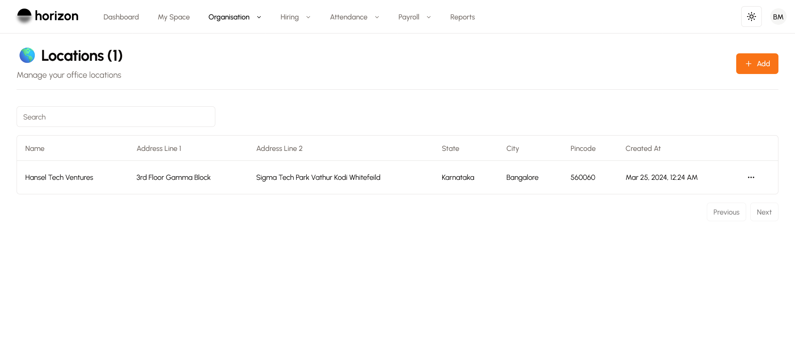
- **Location Management:** Manage multiple operating locations.
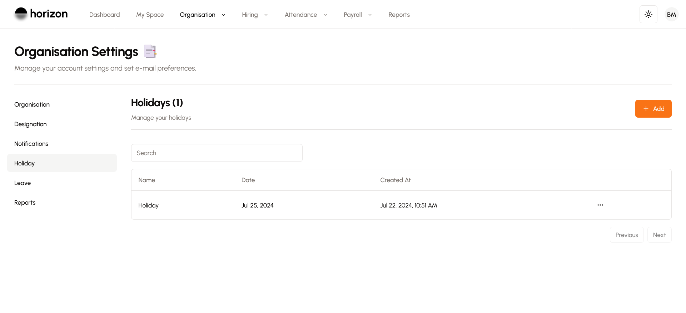
- **Additional Settings:**
    - <b>Designations:</b> Define company hierarchy and role structures.
    - <b>Holidays:</b> Plan and manage company-wide holidays.
    - <b>Leave Configuration:</b> Set up leave types and quotas.

#### 5. Leave Tracker
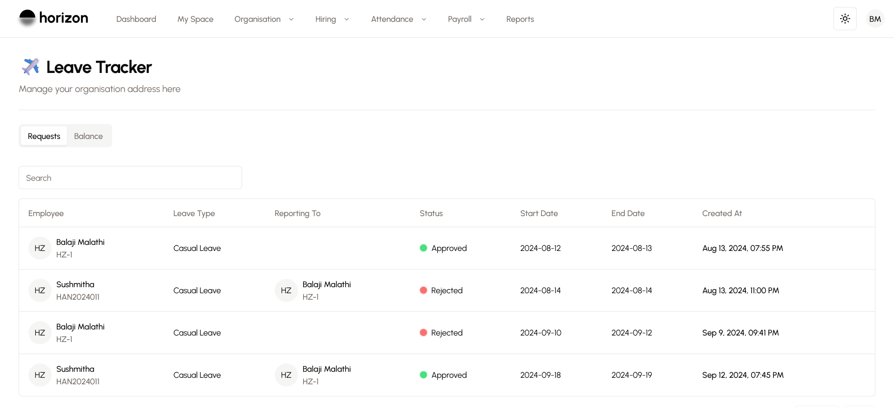
- Employees submit leave requests, managers approve them, and the system tracks everything automatically.
- HR can monitor all employees' leave balances in one place.

#### 6. Timesheets
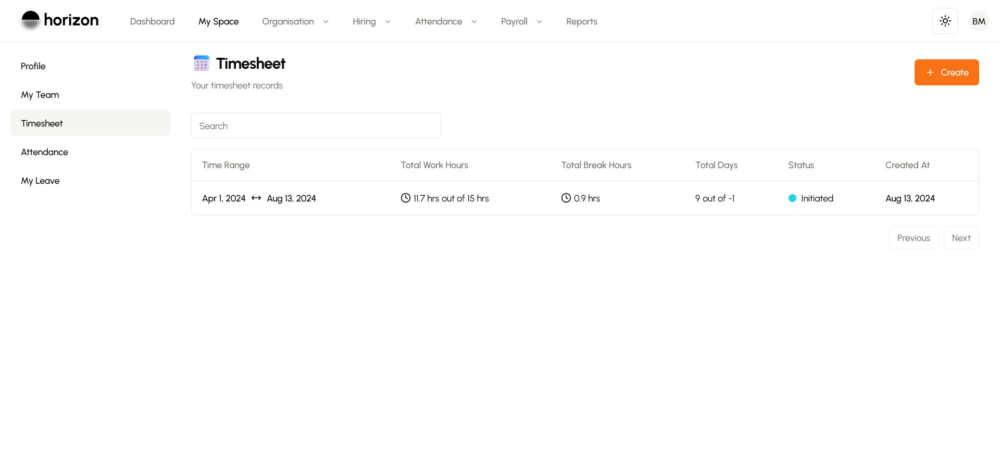
- Employees submit timesheets for a selected date range, and managers approve them seamlessly.
- Timesheet submission is a crucial step in payroll processing.

#### 7. Attendance Tracking
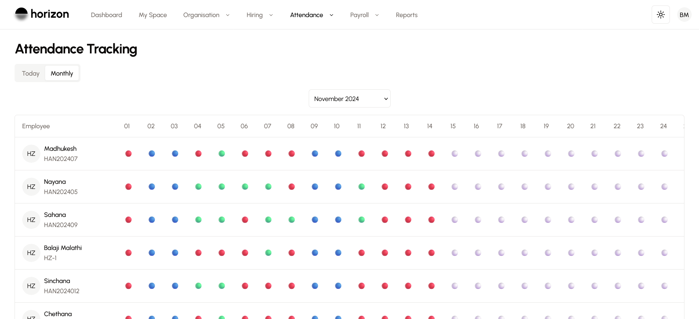
- Consolidated view of employee attendance for today or an entire month.

#### 8. Shift Management
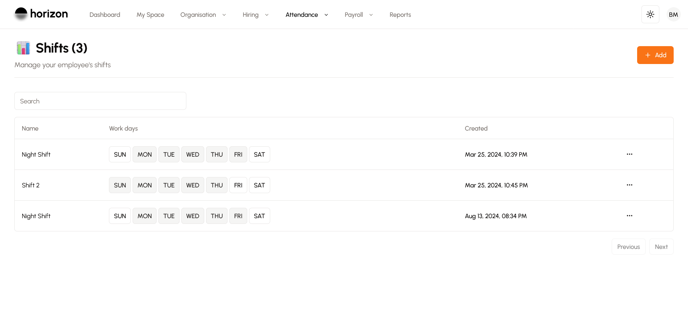
- Assign shifts to employees at the time of login for efficient workforce management.

#### 9. Login Time Adjustments
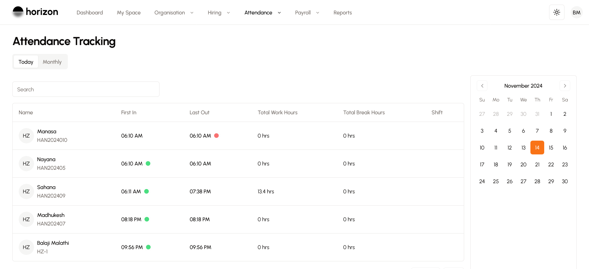
- Employees can request login time adjustments if they forget to punch in, ensuring accurate attendance records.

#### 10. Hiring Management
- **Candidate Management:** Add candidates, track their progress, and manage open positions.
- **Workflow Manager:** Define custom hiring workflows for each position.
- **Interview Scheduling:** Schedule interviews and track candidates from application to onboarding.

#### 11. Payroll Management
- **Payroll Settings:** Control payroll processing schedules, payslip distributions, salary disbursement dates, and payment cycles.
- **Salary Components:** Customize earnings and deductions, with options for fixed amounts, percentages of CTC, or dynamic calculations.
- **Payroll Runs:** Create payroll runs for selected date ranges and generate payroll summaries.
- **Warnings:** Highlight potential issues, such as missing salary configurations or timesheets.

#### Technical Stack
- **Frontend:** Next.js (for a responsive and dynamic user interface)
- **Backend:** Quarkus (for high-performance and scalable APIs)
- **Database:** PostgreSQL (for reliable and efficient data storage)
- **Authentication:** Secure email-based login and role-based access control
- **Integration:** APIs for seamless communication between frontend and backend

### Workflow

#### 1. Employee Onboarding
- Add employee details, assign roles, and configure payroll.
- Upload and manage employee-related documents.

#### 2. Daily Operations
- Employees punch in, submit timesheets, and request leave.
- Managers approve timesheets and leave requests.
- HR monitors attendance, leave balances, and payroll data.

#### 3. Payroll Processing
- Configure salary components and run payroll.
- Generate payslips and disburse salaries.
- Address warnings and ensure compliance.

#### 4. Recruitment
- Add candidates, define hiring workflows, and schedule interviews.
- Track candidates from application to onboarding.

### Challenges and Solutions
1. **Ensuring real-time data synchronization across modules.**
    - Implemented WebSocket communication and optimized backend APIs for real-time updates.

2. **Managing complex payroll calculations.**
    - Designed a flexible salary component system with dynamic calculations.

3. **Providing a seamless user experience across devices.**
    - Used Next.js for a responsive web interface and optimized for mobile devices.

### Conclusion

Horizon is a powerful HR management solution that simplifies and automates HR operations, enabling businesses to focus on growth and employee satisfaction. With features like employee self-service, payroll management, leave tracking, and recruitment, Horizon provides a comprehensive platform for managing all aspects of HR. Built with Next.js, Quarkus, and PostgreSQL, Horizon is scalable, secure, and user-friendly, making it an ideal choice for businesses of all sizes.

### Future Enhancements
- **AI-Powered Insights:** Integrate AI for predictive analytics and workforce planning.
- **Mobile App:** Develop a dedicated mobile app for on-the-go HR management.
- **Multi-Language Support:** Add support for multiple languages to cater to a global audience.
- **Integration with Third-Party Tools:** Enable integration with tools like Slack, Google Workspace, and accounting software.