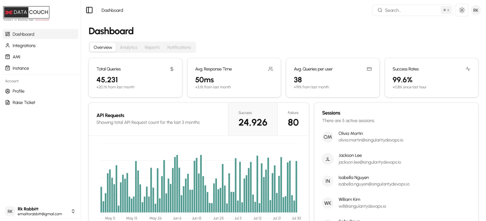
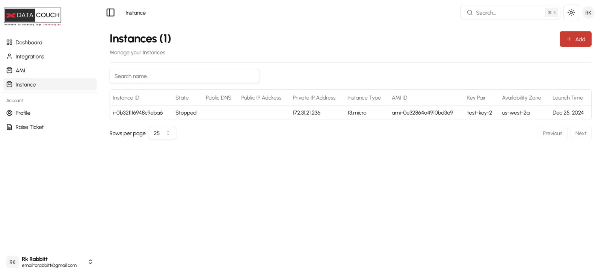
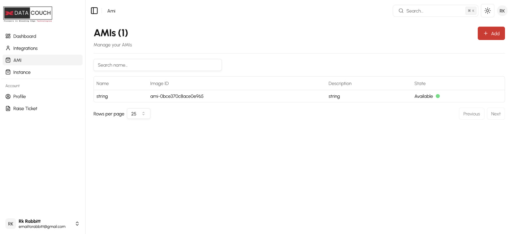
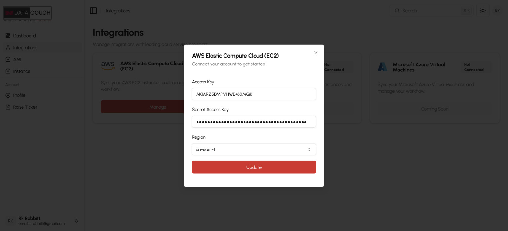

The RDP application is designed to integrate seamlessly with an existing LMS, enabling administrators to create AMIs (Amazon Machine Images) and manage instances efficiently. This solution leverages Apache Guacamole for remote desktop access, allowing students to access pre-configured virtual machines.

#### Tech Stack
- **Frontend:** Next.js, Tailwind CSS
- **Backend:** Quarkus
- **Database:** PostgreSQL
- **Cloud Provider:** AWS
- **Remote Desktop Protocol:** Guacamole

#### Features
- <b>User Management</b>
    - Admins can add students and learners to the platform.

- <b>Instance Management</b>

    - Create, start, stop, pause, hibernate, and terminate instances.
    - Centralized control for managing virtual environments.

- <b>AMI Creation</b>

    - Generate AMIs to provide predefined environments for students.
- <b>LMS Integration</b>
    - Currently supports AWS-based integrations.
    - Seamless connection with LMS platforms through links or redirection buttons.
- <b>Integrations</b>

    - Facilated integrations from multiple VM providers
    - Currently works only for AWS
#### Workflow
- Admin creates an AMI link.
- The AMI link is embedded into the LMS as a redirection button or link.
- Students click on the link and log in to the LMS.
- Once authenticated, students can start an instance and gain access to a pre-configured remote environment.

#### Conclusion

This RDP application provides a seamless, scalable remote desktop solution for LMS platforms. With AWS-powered infrastructure and Guacamole for remote access, it offers an efficient way to manage virtual learning environments.

